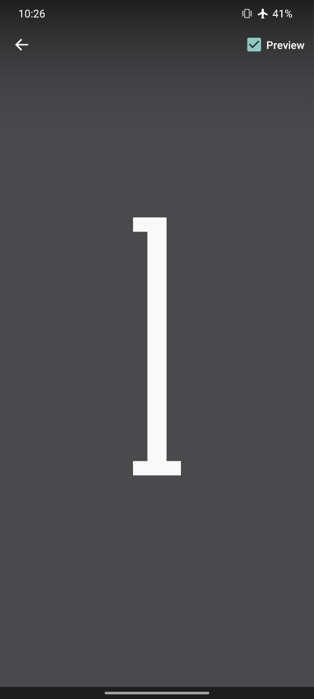

# unlock-clock
Dark Theme version of the live wallpaper by Google https://experiments.withgoogle.com/unlock-clock


**Before**                           |  **After**
:--------------------------------:|:------------------------------:
   |  

## Change to your favourite colour

```
Update values in 
./liveWallpaper/data-livewallpaper/app/src/main/res/values/colors.xml

Change 
<color name="colorPrimary">[#color code]</color>

Build Apk in Android Studio

Install Apk
```

## To install current version

```
install

live_wallpaper.apk
```